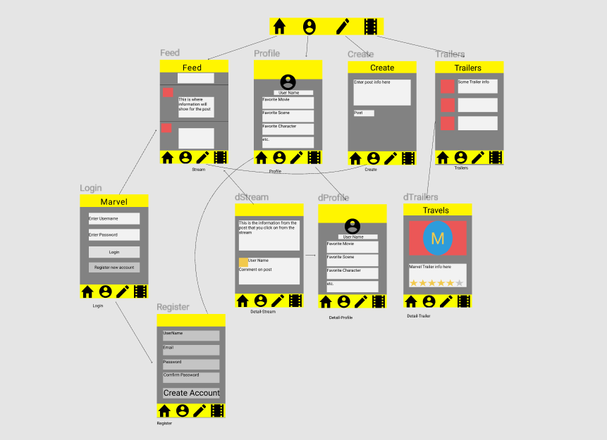

Group Project - README Template
===

# Marvel Fan Club

## Table of Contents
1. [Overview](#Overview)
1. [Product Spec](#Product-Spec)
1. [Wireframes](#Wireframes)
2. [Schema](#Schema)

## Overview
### Description
This app will allow you to interact with other Marvel fans by discussing favored movies and scenes, 
share hype or disdain for trailers, and view a tribute to the late Stan Lee, founder of Marvel.

### App Evaluation
- **Category:** Social Media
- **Mobile:** This app would primarily be used for mobile devices. While it could function on a pc, it would most
likely have additional features on a mobile platform.
- **Story:** Connects Marvel fans together to share or discuss opinions in a public platform.
Users would be required to register an account to use the profile features such as friending other
fans.
- **Market:** This app would be best for persons older than 18, considering the toxicity that could arise from
differing opinions. Such negativity would not be appropriate for adolescence. While the forums would be monitered, there is not guarantee that inappropriate behavior would never occur.
- **Habit:** This app could be used anytime, however the best time would be after the announcement of a brand new Marvel movie.
- **Scope:** This would start as a simple forum/social media platform that could evolve to a hub for fan art and fan fics for
favorite Marvel cast members.

## Product Spec

### 1. User Stories (Required and Optional)

**Required Must-have Stories**

* Register account
* Login to account
* Post, like, favorite and rate pictures of movies
* Page of trailers that can be commented on and rated
* Tribute page for the great Stan Lee

**Optional Nice-to-have Stories**

* Forum page
* Comic creation page
* Fanfic page
* Friends/Followers
* Debate Page

### 2. Screen Archetypes

* Login 
   * Login account
* Register
    * Create an account
* Profile
    * info
    * picture
    * likes?
* Stream
    * Feed
* Trailers
    * Clips and release dates
* Tribute Page
    * Picture of Stan Lee
    * Bio 
    * Fan comments
* Detail
    * Click on in stream
    * shows detail of posts
* Trailer Detail
    * comments
    * rating bar
    * hype, hate

### 3. Navigation

**Tab Navigation** (Tab to Screen)

* Stream
* Profile
* Creation
* Trailers

**Flow Navigation** (Screen to Screen)

* Login
   * Stream
* Register
   * Profile
* Stream
    * Detail
* Creation
    * Stream
* Trailers
    * Trailer details
* Profile
    * Tribute

## Wireframes
[Add picture of your hand sketched wireframes in this section]

### [BONUS] Digital Wireframes & Mockups

### [BONUS] Interactive Prototype

## Schema 
[This section will be completed in Unit 9]
### Models
[Add table of models]
### Networking
- [Add list of network requests by screen ]
- [Create basic snippets for each Parse network request]
- [OPTIONAL: List endpoints if using existing API such as Yelp]- [OPTIONAL: List endpoints if using existing API such as Yelp]- [OPTIONAL: List endpoints if using existing API such as Yelp]- [OPTIONAL: List endpoints if using existing API such as Yelp]- [OPTIONAL: List endpoints if using existing API such as Yelp]- [OPTIONAL: List endpoints if using existing API such as Yelp]- [OPTIONAL: List endpoints if using existing API such as Yelp]- [OPTIONAL: List endpoints if using existing API such as Yelp]
